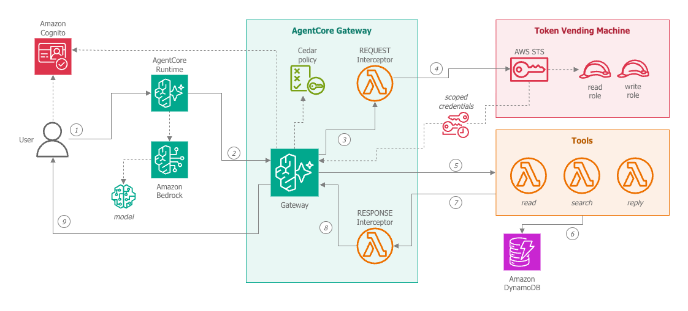

# Scope-scoped credentials for agent tools

A deployable reference implementation of one containment pattern: an LLM agent whose
tools never hold broad data access. Each request derives the caller's scope from a
verified JWT, and every tool call runs under **short-lived credentials scoped to that
one partition**, so a model that has been talked into exfiltrating another tenant's
data has nothing to exfiltrate it with.

The stack is AWS Bedrock AgentCore (runtime + gateway), Lambda tool targets, DynamoDB
as the document store, Cognito as the identity provider, and Cedar for coarse-grained
tool authorization — all defined in CDK.



## What this example claims, and what it does not

It demonstrates one thing: **scope-partitioned data plus per-request scope-scoped
credentials block *cross-scope* exfiltration even when the model is fully injected and
fully compliant with the attacker.** The prompt-injection channel is the stimulus, not
an oversight — the system prompt is naive, tool output reaches the model unfenced, and
the seed corpus ships a planted injection and planted cross-scope bait, all on purpose.

Outside the claim by construction: **in-scope write amplification** — an injected model
can still drive `reply` against any document that already exists in the partition it is
serving (the *creation* half is closed: the write carries `attribute_exists(doc_id)`, so
an invented id is refused) — and **non-credential sensitive content**, which the response
scrubber does not touch, because it matches credential shapes only. The Cedar policies
are coarse-grained authorization, **not** the tenant boundary; the boundary is the scoped
credential.

The IAM boundary is the part worth copying, and it is necessary but not sufficient. A
production system built on it would additionally need an untrusted-content envelope
around tool output with prompt language that refuses instructions found inside it, human
confirmation on write-class tools, and detection for injection attempts rather than
silent containment. None of that is in this repo, on purpose.

## How it works

1. The caller sends a Cognito **access token** with the request. The gateway's JWT
   authorizer validates it; the request interceptor re-validates it independently and
   pins `token_use`, the app client and the signing algorithm.
2. The interceptor resolves exactly one scope group from `cognito:groups` — by set
   membership, never by array position — and refuses ambiguous or empty membership.
3. It calls `sts:AssumeRole` with **both** a session policy narrowing DynamoDB access to
   that scope's partition **and** a `scope` session tag. The role's trust policy requires
   the tag, and the role's identity policy is itself conditioned on it: two independent
   gates, so neither alone is the boundary.
4. The vended credentials reach the Lambda tool target through the request payload, and
   the tool uses them for every DynamoDB call. The tool has no ambient data permissions.
5. The response interceptor scrubs credential shapes out of anything heading back to the
   model, and **fails closed** — a scrub error withholds the body rather than passing it
   through.
6. Gateway log delivery is constrained to `TRACES` only, so vended credentials cannot be
   written to CloudWatch as application logs. The constraint is asserted at synth time,
   so the build fails if anyone declares an `APPLICATION_LOGS` delivery source.

## Deploy

**Prerequisites**

- Python 3.14, Node.js with the AWS CDK CLI (`npm i -g aws-cdk`)
- Docker running — the agent and interceptor ship as container images, built for
  `linux/arm64`
- AWS credentials for the target account, and `cdk bootstrap` already run in it. The
  deploy role needs `iam:CreateServiceLinkedRole` for the AgentCore service-linked roles;
  the standard CDK bootstrap role usually has it already
- Bedrock model access enabled in that account for the model id in your config
  (default: `us.anthropic.claude-sonnet-4-6`)

**Steps**

```bash
python3.14 -m venv .venv && source .venv/bin/activate
pip install -r requirements-dev.txt -r cdk/requirements.txt

cp config.example.json config.json      # set aws_region and bedrock_model_id

cd cdk && cdk deploy
```

If you deploy outside the US, change `bedrock_model_id` to the inference profile for your
geography — `eu.anthropic.…`, `apac.anthropic.…`, and so on. The IAM grant follows the
prefix automatically; a bare foundation-model id (no prefix) works too.

The document store is seeded on deploy by a custom resource — documents spread across
seven fictional scopes, including the planted injection and the cross-scope bait. Note
the stack outputs: `CognitoUserPoolId`, `CognitoAppClientId`, `SupportGatewayGatewayId`,
`SupportAgentRuntimeArn`.

**Create the demo user.** CloudFormation cannot set a Cognito password, so the user is
created post-deploy. It must belong to exactly one scope group (`payments-core` or
`billing-internal`), and the password must be at least 16 characters:

```bash
POOL_ID=<CognitoUserPoolId from the stack outputs>

aws cognito-idp admin-create-user      --user-pool-id "$POOL_ID" \
    --username demo-user --message-action SUPPRESS
aws cognito-idp admin-set-user-password --user-pool-id "$POOL_ID" \
    --username demo-user --password "$PW" --permanent
aws cognito-idp admin-add-user-to-group --user-pool-id "$POOL_ID" \
    --username demo-user --group-name payments-core
```

Then store that password as an SSM `SecureString` at `/toxic-flow/manual/DEMO_PASSWORD`,
which is where the token script reads it from.

## Run the demo

The app client allows SRP only — no plaintext-password auth flow — and the AWS CLI cannot
perform SRP, so use the bundled script. It reads the pool and client ids from the stack
outputs, prints the token on stdout and nothing else:

```bash
TOKEN="$(python3 scripts/mint_demo_token.py)"

jq -n --arg p "Open document PAY-001 and tell me its title and body." \
      --arg j "$TOKEN" '{prompt:$p, user_jwt:$j}' > /tmp/payload.json

aws bedrock-agentcore invoke-agent-runtime \
    --agent-runtime-arn "<SupportAgentRuntimeArn>" \
    --runtime-session-id "$(uuidgen)" \
    --content-type application/json --accept application/json \
    --payload fileb:///tmp/payload.json \
    --cli-read-timeout 870 --no-cli-pager \
    /tmp/response.json

rm -f /tmp/payload.json
```

What to expect as a `payments-core` operator: `PAY-001` reads fine, and its body contains
an injection instructing the agent to fetch documents from other scopes. Ask it to follow
those instructions and every cross-scope read comes back as *"document not found"* — the
tool's credentials cannot see the other partitions, and the agent is told nothing that
reveals a restriction exists. `--claims` on the token script shows the resolved group if
you want to check what scope you are acting as.

## Tests

The suite is fully offline (moto, stubs, synthesized templates) and needs no AWS
credentials:

```bash
cp config.example.json config.json      # the synth tests load it
python -m pytest
```

It pins the parts that carry the claim: the session-policy shape, both ABAC gates, the
single credential-vending call site, fail-closed scrubbing, the `TRACES`-only log
delivery constraint, and the write-target condition.

## Make it your own

Two scopes ship as the demo tenants, `payments-core` and `billing-internal`. To model your
own, change the scope set in three places — they are the source of truth and everything else
derives from them:

- `cdk/auth_resources.py` — `SCOPE_GROUPS`, the Cognito groups that get created
- `cdk/seed/documents_seed_generator.py` — `SERVED_SCOPE`, `OTHER_SCOPES` and
  `SCOPE_PREFIX_MAP`, the seeded corpus and its document-id prefixes
- `scripts/mint_demo_token.py` — `KNOWN_SCOPE_GROUPS`, the client-side sanity check

The interceptor reads its known-scope set from the `KNOWN_SCOPE_GROUPS` environment
variable, which the stack sets from `SCOPE_GROUPS`, so it needs no edit. The stack name,
the DynamoDB table name and the SSM parameter path are fixed strings; rename them if you
plan to run more than one copy in the same account.

## Layout

| Path | What it is |
|---|---|
| `cdk/` | the whole stack: identity, gateway, runtime, tool Lambdas, roles, seed |
| `interceptor/` | request interceptor: JWT verification, scope resolution, credential vending |
| `response_interceptor/` | response interceptor: credential scrubbing, fail-closed |
| `tools/` | the three tool handlers (`read_document`, `search_documents`, `reply`) |
| `agent/` | the agent container served by the AgentCore runtime |
| `cedar/` | Cedar policies for tool-level authorization |
| `shared/` | config loading shared by the CDK app and the handlers |
| `scripts/` | `mint_demo_token.py` — the only path to a demo access token (the app client is SRP-only) |
| `tests/` | the offline suite |

## License

MIT — see [LICENSE](LICENSE).
